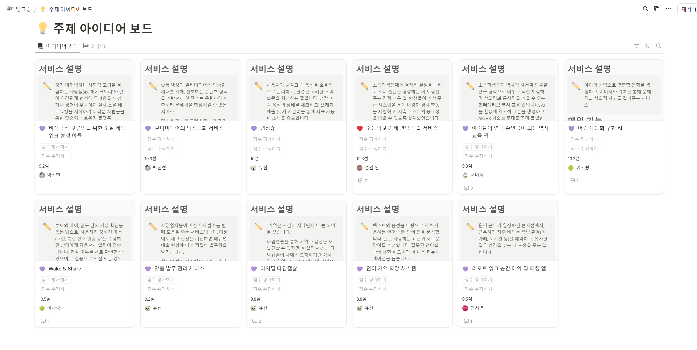

# 프로젝트 개발 일지

본 README는 프로젝트 진행 과정을 날짜별로 정리한 기록입니다. 각 날짜별 작업 내용과 스크린샷, 부가 설명이 포함되어 있습니다.

---

## 목차

-   [2025-01-13 작업 기록](#2025-01-13-작업-기록)
-   [2025-01-14 작업 기록](#2025-01-14-작업-기록)
-   [2025-01-15 작업 기록](#2025-01-15-작업-기록)
-   [2025-01-16 작업 기록](#2025-01-16-작업-기록)
-   [2025-01-17 작업 기록](#2025-01-17-작업-기록)

---

## 날짜별 작업 기록

### 2025-01-13 - 아이디어 기획

#### 작업 1: 팀원별 아이디어 피드백

| **항목**      | **내용**                                                                                              |
| ------------- | ----------------------------------------------------------------------------------------------------- |
| **작업 설명** | - 작업 내용을 간단히 설명합니다.   - 주요 변경 사항이나 추가된 기능을 나열합니다.                  |
| **스크린샷**  |    _스크린샷에 대한 간단한 설명을 작성하세요._ |
| **관련 링크** | - [깃허브 커밋 링크](#)   - [참고 자료 링크](#)                                                    |

---

#### 작업 2: 작업 제목

| **항목**      | **내용**                                                                                              |
| ------------- | ----------------------------------------------------------------------------------------------------- |
| **작업 설명** | - 작업 내용을 간단히 설명합니다.   - 주요 변경 사항이나 추가된 기능을 나열합니다.                  |
| **스크린샷**  |    _스크린샷에 대한 간단한 설명을 작성하세요._ |
| **관련 링크** | - [깃허브 커밋 링크](#)   - [참고 자료 링크](#)                                                    |

---

#### 작업 3: 작업 제목

| **항목**      | **내용**                                                                                              |
| ------------- | ----------------------------------------------------------------------------------------------------- |
| **작업 설명** | - 작업 내용을 간단히 설명합니다.   - 주요 변경 사항이나 추가된 기능을 나열합니다.                  |
| **스크린샷**  |    _스크린샷에 대한 간단한 설명을 작성하세요._ |
| **관련 링크** | - [깃허브 커밋 링크](#)   - [참고 자료 링크](#)                                                    |

---

### 2025-01-14 - 아이디어 구체화 및 컨설턴트님 미팅팅

| **항목**      | **내용**                                                                                                        |
| ------------- | --------------------------------------------------------------------------------------------------------------- |
| **작업 내용** | - 작업 내용을 간단히 설명합니다.   - 주요 변경 사항이나 추가된 기능을 나열합니다.                            |
| **스크린샷**  |    _스크린샷에 대한 간단한 설명을 여기에 작성하세요._ |
| **관련 링크** | - [깃허브 커밋 링크](#)   - [참고 자료 링크](#)                                                              |

---

### 2025-01-15 - 데이터 수집 및 문서작업업

| **항목**      | **내용**                                                                                                        |
| ------------- | --------------------------------------------------------------------------------------------------------------- |
| **작업 내용** | - 작업 내용을 간단히 설명합니다.   - 주요 변경 사항이나 추가된 기능을 나열합니다.                            |
| **스크린샷**  |    _스크린샷에 대한 간단한 설명을 여기에 작성하세요._ |
| **관련 링크** | - [깃허브 커밋 링크](#)   - [참고 자료 링크](#)                                                              |

---

### 2025-01-16 - 작업 제목

| **항목**      | **내용**                                                                                                        |
| ------------- | --------------------------------------------------------------------------------------------------------------- |
| **작업 내용** | - 작업 내용을 간단히 설명합니다.   - 주요 변경 사항이나 추가된 기능을 나열합니다.                            |
| **스크린샷**  |    _스크린샷에 대한 간단한 설명을 여기에 작성하세요._ |
| **관련 링크** | - [깃허브 커밋 링크](#)   - [참고 자료 링크](#)                                                              |

---

### 2025-01-17 - 작업 제목

| **항목**      | **내용**                                                                                                        |
| ------------- | --------------------------------------------------------------------------------------------------------------- |
| **작업 내용** | - 작업 내용을 간단히 설명합니다.   - 주요 변경 사항이나 추가된 기능을 나열합니다.                            |
| **스크린샷**  |    _스크린샷에 대한 간단한 설명을 여기에 작성하세요._ |
| **관련 링크** | - [깃허브 커밋 링크](#)   - [참고 자료 링크](#)                                                              |

---

## 추가 정보

추가적으로 기재할 내용이 있다면 여기에 작성하세요.
