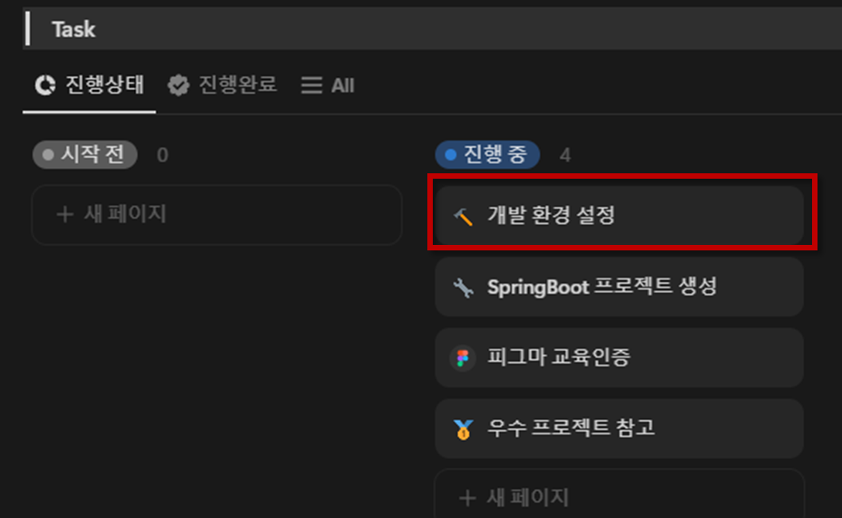
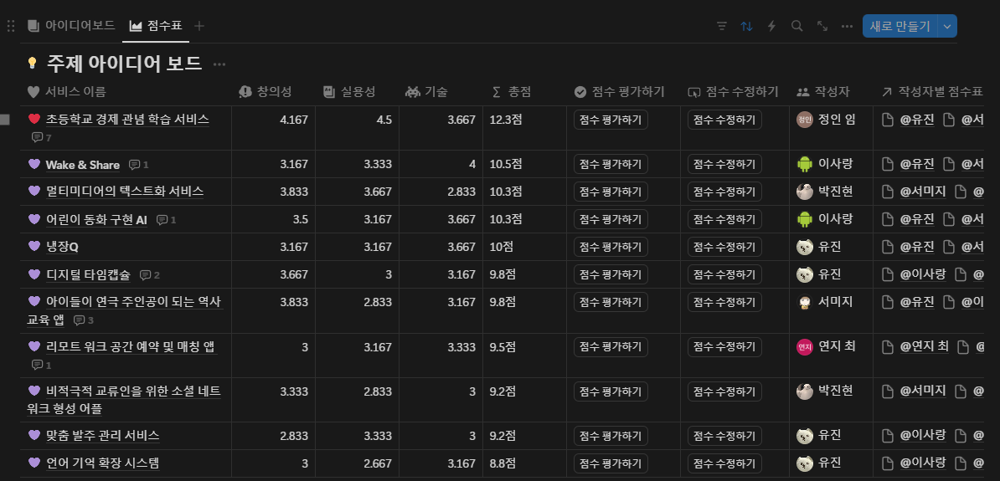

# TIL (Today I Learned)

| 조번호 | 이름      | 날짜       |
| ------ | --------- | ---------- |
| D107     | 이사랑    | 2025-01-13 |

## 오늘 한 일
- 개인 노트북 개발 환경 설정 진행
    - Android, Intelij, JDK 등
- 환경 설정 과정 기록 후, 팀 Notion 공유
    
- 팀 내 개발 규칙을 정하는데 참여
    - Git Commit 규칙, code 작성 방법, git config 설정 등
- 관통 PJT 진행을 위한 아이디어 수집
    - 생성형 AI 적극 활용
    - 사용 대상(사회적 약자, 소외계층, 특수 직업, 특정 연령대), 개발 목적(문제 해결, 삶의 질 향상...) 등 한정된 분야가 아닌 최대한 다양한 아이디어를 위해 프롬프트를 설정하고 아이디어 수집 진행
- 관통 PJT 개인 아이디어 제출 (2개씩)
    - 어린이 동화구현 AI
        - 아이들이 동물/배경/색 등 자신이 좋아하는 몇가지 키워드를 생각하면 해당 선택지를 바탕으로 동화 문장을 구현하고, 이미지 생성ai, 음성도구 등을 통해 하나의 동화 구현
        - 아이들이 책에 흥미를 갖게 하고, 자신만을 위한 동화를 만들어 갈 수 있다는 장점이 있음
    - Wake & Share
        - 친구끼리, 혹은 부모-자녀 간 공유 가능한 알람 어플
        - 지정한 상대가 알람을 끄고 일어났는지 확인 할 수 있으며, 기상이 확인되지 않는 경우 강제 알람 설정을 통해 상대측에서 즉시 알람 발생이 가능하게 하는 어플
        - 서로 연락하기 바쁜 아침, 전화할 수 없는 상황 등에서 쓰일 것으로 기대
        - 피드백 후... : 기술적인 부분에서 강제적으로 소리 알람을 발생시킬 수 없는 것으로 보여짐
- 아이디어 상호 평가 진행
    
    - 이후 선정된 상위 몇개 항목에 대하여 추가 자료조사 진행
    - 유사 서비스 유무
    - 부족한 상황에 대한 피드백 진행 ex) ai 활용 방안, 특정 기능에 대한 추가 설명 요구 등

## 문제 있었던 것
- 이상 없음

## 새로 배운 것
- .

## 아직 잘 모르는 것, 부족한 것
- 다양한 시각에서 문제를 바라보고, 찾아내는게 어려운 것 같다. 계속 같은/비슷한 틀에서만 아이디어가 생각이나서 창의적인 아이디어 주제를 내지 못해서 아쉬웠다.
- 아이디어를 제시하고, 그 주제를 다른사람이 설득할만한 근거 사항이 있어야 하는데 그런 설득하는 능력이나 자료 수집이 미숙했다고 느꼈다.

## 잘 한 것
- 못하더라도 최대한 적극 참여 하려고 노력 .. !