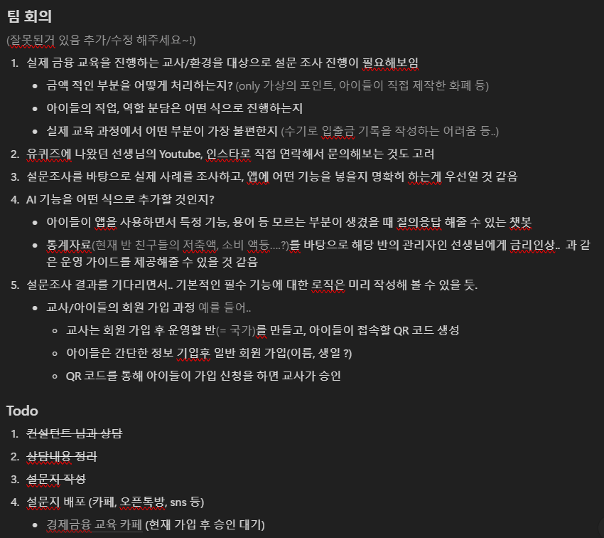

# TIL (Today I Learned)

| 조번호 | 이름      | 날짜       |
| ------ | --------- | ---------- |
| D107     | 이사랑    | 2025-01-14 |

## 오늘 한 일
- 오전 팀회의 참여
    - 앞으로 진행할 개발 주제와 관련해서 어떤 식으로 AI 를 활용할지 함께 논의
    

- 컨설턴트님, 코치님과 첫 미팅 진행
    - PJT 아이디어 소개 : 어린이 동화구현 AI
    - 이전 기수에서 자주 진행했던 프로젝트이며, 다른 조에서도 언급되었던 주제라는 평가를 받음.
    - 다른 기수 진행사례를 듣고, 만약 해당 주제로 진행할 경우 우리만의 특별한 부가 기능 혹은 높은 완성도가 필요할 것 같다고 느낌.
    - 다른 아이디어중 '초등학교 경제 관념 학습 서비스' 가 팀원 모두 흥미를 가진 분야이기도 하고, 자료 조사도 많이 진행했던 주제로 해당 아이디어로 결정 !
- 미팅 결과 회의록 작성
- 요구사항 명세서를 작성하기 전, 실제 초등교사 대상으로 설문조사를 진행하기 위해 설문 항목 작성
- 협업 툴인 Jira 학습 및 활용
- 디자인 방향성을 잡기 위한 샘플 시안 수집 => Pinterest
- Android 사전 학습 진행, 추후 관련 자료 공유 예정 (프로젝트에 적용될법한 내용 위주로)
    - 디자인 패턴 개념학습, 코드 실습 (MVC, MVVM)
    - Android 테스트 도구 조사 : JUnit, Espresso (성능 측정시 유용할 것으로 보임)

## 문제 있었던 것
- 이상 없음

## 새로 배운 것
- Android 에서 생각보다 다양한 테스트 도구가 있다는 것과, 해당 도구를 잘 활용하기만 한다면 메모리를 과다하게 소비하거나 오류가 있는 부분을 빠르게 개선해 나갈 수 있을 것 같았다. 아직 어떤식으로 활용하는지는 잘 모르겠지만 이번 기회에 해당 툴들을 적극 활용해서 성능을 개선해나가는 과정도 경험해보고 싶다.

## 아직 잘 모르는 것, 부족한 것
- Android 에서 제공하는 다양한 테스트 도구 활용법

## 잘 한 것
- 추후 개발에 필요하거나 사용될 개념을 미리 학습함으로써, 개발 시 불필요한 시간 소모를 줄일 수 있었다고 생각합니다. 앞으로도 나머지 부분을 신속히 학습하고 정리하여 팀원들과 공유함으로써, 실제 개발 기간에는 자료 조사나 개념 정리에 시간을 빼앗기지 않고 개발 자체에만 온전히 집중할 수 있도록 준비하고자 합니다.