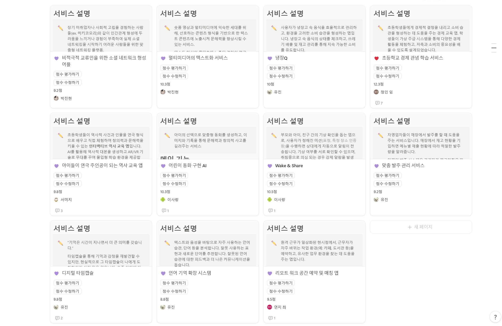
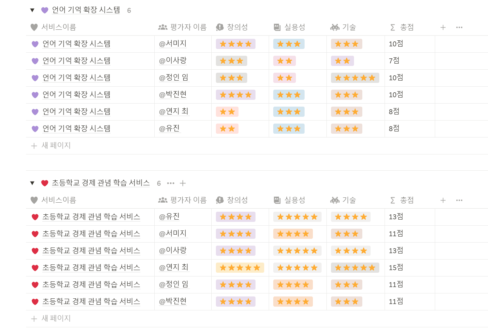

## TIL : 2025-01-13

### 오늘 한 일 ✍️
1. 팀원별 아이디어 공유
    
2. 아이디어 평가 및 순위 매기기
    
3. 개발환경 설정
4. 실습코치님 피드백
5. 피드백 바탕으로 해당 주제 내용 구체화하기
6. 아이디어 제안 및 공유  
    - 제시한 아이디어는 **'초등학생 경제 교육을 위한 가상 주급 시스템'** 으로, 학생들이 가상 주급을 받고 세금 공제, 소비, 저축 등을 체험하며 경제적 결정을 학습할 수 있는 서비스입니다. 팀원들 및 실습코치님께 긍정적인 피드백을 받았습니다.

### 문제가 있었던 것 ❌
1. 컨설턴트님께 아직 피드백을 받지 못했습니다..!

### 새로 배운 것 🌱
1. 어린이 사용자를 대상으로 서비스를 구현한 적이 처음이라 기능 자체가 더 쉽고 재미있게 표현되어야 한다는 부분을 처음으로 생각해보게 되었습니다.

### 아직 잘 모르는 것, 부족한 것 🧐
1. 경제 관념을 아이들이 쉽게 이해할 수 있도록 쉽게 풀어내기!
2. 경제 관련 배경 지식에 대해 공부하기 

### 잘한 것 ✨
1. 아이디어 방향성 잡기 성공!