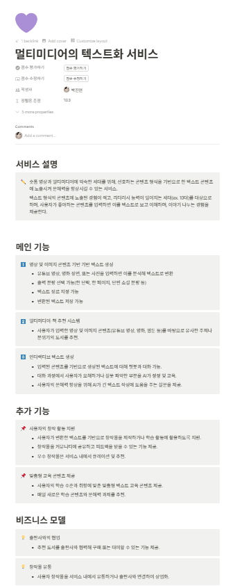
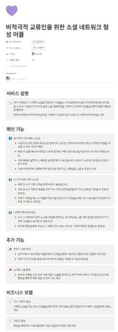
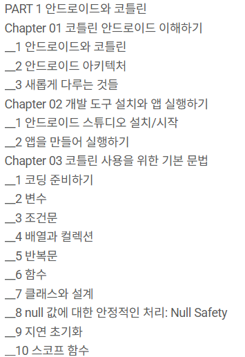

# 2025-01-13 TIL
## 오늘 한 일
### 아이디어 회의
제안한 아이디어 1: 멀티미디어의 텍스트화 서비스
```
숏폼 영상과 멀티미디어에 익숙한 세대를 위해, 선호하는 콘텐츠 형식을 기반으로 한 텍스트 콘텐츠에 노출시켜 문해력을 향상시킬 수 있는 서비스. 

텍스트 형식의 콘텐츠에 노출된 경험이 적고, 리터러시 능력이 떨어지는 세대(ex. 10대)를 대상으로 하며, 사용자가 좋아하는 콘텐츠를 입력하면 이를 텍스트로 보고 이해하며, 이야기 나누는 경험을 제공한다.
```

제안한 아이디어 2: 비적극적 교류인을 위한 소셜 네트워크 형성 어플
```
장기 미취업자나 사회적 고립을 경험하는 사람들(ex. 히키코모리)와 같이 인간관계 형성에 두려움을 느끼거나 경험이 부족하여 실제 소셜 네트워킹을 시작하기 어려운 사람들을 위한 맞춤형 네트워킹 플랫폼.

온라인 환경에서 편안하게 교류를 시작할 수 있도록 도와 사용자의 사회적 관계 형성을 지원.
```
그 외 팀원들이 제안한 아이디어들에 대해 평가하여 순위를 매기고, 피드백 및 조사.




### 팀 아이디어 실습 코치님들께 피드백

초등학교 경제 관념 학습 서비스
```
민경 코치 : 기획의도가 좋습니다. 또 나온 주제 중에 가장 좋은 것 같아요! 실제 초등학교 교사들이 겪는 어려움에 대해 개선점을 제안한 기능들이니 더 설득력도 있을 것 같아요. 단, 초등학생이라는 사용층에 맞게 기능 자체가 경제에 대해 더 쉽고 재미있게 표현되어야 할 것 같습니다! = good 

효진 코치 : 일단 기획 디테일과 배경은 유튜브로 충분히 가능할거 같고 구체화가 중요할 것 같네요. 사실 경제 관념을 게이미피케이션하게 풀어내는게 고민이 많이 필요할 것 같습니다.
실제 사용환경은 어떻게 되는지, 직업은 어떤게 있고 어떤 역할을 할 수 있는지, 금액적인 상호작용 부분을 디테일하게 가져와주시면 꽤 좋은 앱이 될 것 같습니다. Youtube를 보고 공감이 된건지 가장 주제로 잘 선정한 것 같구요. 메인 기능으로 적어주신게 사실 잘 상상이 되진 않지만, 조금만 더 디벨롭하면 재밌을 것 같네요!
```
    
멀티미디어의 텍스트화 서비스
```
민경 코치 : 문해력 관련 주제는 무난한 주제입니다. 음 사용자 층이 10대면 게임 요소를 추가해보는건 어떨까요? 텍스트 형식의 콘텐츠에 노출된 경험이 적다면 유사한 주제나 분위기의 도서를 추천하더라도 읽지 않을 가능성이 높아보입니다! 사용자층에 맞게 앱을 활용해서 문해력을 키울 수 있는 방안을 생각해보세요! = good 

효진 코치 : 멀티미디어 텍스트화하는 과정을 더 설득력 있게 기획하는게 좋아보입니다! 개인적인 견해지만 글자보다 장면이 편하고 재미있기 때문에 본다고 생각합니다. 그렇다면 굳이 재미없는 텍스트로 다시 바꾸는 것은 사용자 측면에서 실용성이 떨어진다고 보입니다. 물론, '문해력'이라는 키워드가 있지만, 제시해주신 기능이 문해력을 증진시키는데 도움을 어떻게 줄지도 설명이 필요할 것 같습니다.
문해력 해결하는 컨텐츠로 현재 상황에 알맞는 사자성어를 그저 텍스트로 띄우는것이아니라 보기 4개중에 고른다거나 문제식으로 교육하는 디테일한 컨텐츠를 생각해보는 것은 어떨까 합니다!
```
### 코틀린 개인 학습
- 안드로이드 스튜디오 기초적 사용법
- 코틀린과 안드로이드 이해
- 코틀린 기본 문법



## 문제가 있었던 것
안드로이드 스튜디오가 낯설어, 프로젝트를 생성하고 사용해보는데 어려움을 겪었다.
자바 언어 사용 경험이 없어, 자바 기반 코틀린 문법을 이해하는데 시간이 걸렸다.
"이것이 안드로이드다(with 코틀린)" 교재를 사용하여 개인 학습을 진행하였는데, 안드로이드 스튜디오 프로그램의 버전 차이 때문인지, 뷰 바인딩에 대한 코드가 교재대로 실행되지 않아, 추가적 검색을 통해 학습하였다.

```
 private ActivityMainBinding binding;
```
```
 binding = ActivityMainBinding.inflate(getLayoutInflater());
 setContentView(binding.getRoot());
```

## 새로 배운 것
### 접근 제한자
| 접근 제한자 | 제한 범위 |
| --- | --- |
|  private | 다른 파일에서 접근할 수 없음 |
| internal | 같은 모듈에 있는 파일만 접근 |
| protected | private와 같으니 상속 관계에서 자식 클래스가 접근 가능 |
| public | 제한 없이 모든 파일에서 접근 |

### lateint
클래스 안에서 변수만 Nullable로 미리 선언하고 초기화를 나중에 함.

### lazy
읽기 전용 변수 val을 사용하는 지연 초기화.
입력값 변경 불가능. val로 변수를 먼저 선언한 후 코드 뒤에 by lazy 키워드 사용하고 중괄호에 초기화할 값 .

## 부족한 것
내가 제안했던, 멀티미디어의 텍스트화 서비스에 대해 실용성과 실제 구현 방향성에 대해 재고민해보기.
안드로이드 스튜디오와 코틀린을 교재로 공부하며 실습 경험이 필요하다고 느낌. 공부할 대책 마련.

## 잘 한 것 및 느낀 점
다른 팀원들의 아이디어에 대해 피드백 및 추가 조사를 열심히 수행하였다. 팀 내 안드로이드 스튜디오를 사용해야 하는 프론트엔드 담당자 중에 사용경험이 전무한 팀원이 혼자여서 개인으로 공부를 시작했다는 것이 다행이고, 앞으로 빠르게 진도를 마쳐야 할 것 같다.