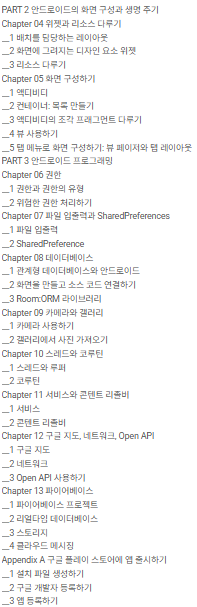

# 2025-01-14 TIL
## 오늘 한 일
### 팀 주제 확정: 초등학교 경제 관념 학습 서비스

서비스 설명

초등학생들에게 경제적 결정을 내리고 소비 습관을 형성하는 데 도움을 주는 경제 교육 앱. 학생들이 가상 주급 시스템을 통해 다양한 경제 활동을 체험하고, 저축과 소비의 중요성을 배울 수 있도록 설계되었습니다.

- 실제 초등학교 교사들이 해당 활동을 진행하면서 겪는 어려움에 대해 조사하고 기획한 아이디어입니다.
- [활동 영상](https://www.youtube.com/watch?v=8hMvV-DCEGs) 해당 시뮬레이션 활동에 대한 영상입니다.

메인 기능 1

**가상 주급 및 세금 시스템**

- 학생들이 직업을 선택하고, 주급을 받으며 경제 활동을 체험
- 주급에서 자리세, 건강보험료 등 세금을 공제받고 실제로 받는 금액을 체험

메인 기능 2

**소비 및 저축 관리 시스템**

- 주급을 받은 후 마트에서 물건을 사거나 저축할 수 있는 기능
- 소비와 저축을 통해 아이들이 돈의 가치를 배우고, 미래를 위해 저축하는 습관을 기를 수 있음.

메인 기능 3

**게임화된 목표 설정 및 피드백 시스템**

- 학생들이 경제 목표를 설정하고 이를 달성하는 과정에서 실시간 피드백을 제공
- AI가 과도한 소비나 부족한 저축을 감지하고 조언을 제공하여 올바른 소비 습관을 유도

 추가 기능

**반 구분 및 방 입장 시스템**

- 학생들이 선생님으로부터 받은 “반 코드”와 비밀번호를 통해 가상 학급에 참여하고, 반별로 시스템을 운영할 수 있도록 지원

**적금 및 이자 시스템**

- 아이들이 저축을 통해 이자를 받으며 적금 개념을 자연스럽게 학습

**목표 달성 트래킹**

- 설정한 경제 목표를 트래킹하고, 달성 여부에 대한 피드백을 제공하여 목표 달성에 대한 성취감을 느낄 수 있도록 지원

비즈니스 모델

**학교 및 학급 단위 구독 모델**

- 학교나 학급 단위로 구독을 통해 경제 교육을 체계적으로 제공

**특별 할인 및 콘텐츠 제공**

- 대규모 구독을 통해 특별 할인 혜택 제공

### 팀 주제 자료조사
- 기존 어플: 퍼플 - 경제 교실
- 활동 참조 형상: https://www.youtube.com/watch?v=8hMvV-DCEGs

### 코틀린 개인 학습
- 위젯과 리소스
- 안드로이드 권한

### 피그마 특강
- 교육용 계정 생성
- 피그마 프로젝트의 이해해

## 문제가 있었던 것
컨디션 난조로 조퇴

## 새로 배운 것

### 레이아웃 파일

프로젝트를 처음 생성하면 소스코드를 작성할 수 있는 1개의 액티비티 파일(MainActivity.kt). 화면을 구성할 수 있는 activtiy_mai이라는 이름의 레이아웃 파일. 레이아웃 파일은 소스코드가 아닌 리소스이기에 모두 소문자로 작성. activity_main.xml

리소스: 코틀린으로 작성되는 소스 코드 파일을 제외한 모든 파일. 리소스 파일의 이름은 모두 소문자로 작성.

### 컨스트레인트 레이아웃

안드로이드 기본 레이아웃.

레이아웃 창에 파란 창이 하나 더 있으면 Desig + Blueprint 모드 인 것. Design 모드를 선택하면 하나만 뜸.

컨스트레인트가 가로 또는 세로 양쪽이 쌍으로 연결되면 크기 조절 핸들러와 바이어스를 사용할 수 있음.

핸들러 가운데에 보이는 사각 박스 안의 >> << 모양을 클릭하면 세 가지 모드로 변경할 수 있음

1. 랩 컨텐트 Wrap Content: 위젯의 크기를 내용물의 크기에 맞춘다
2. 픽스트 Fixed: layout_width, layout_height 속성에 입력된 크기로 고정. 
3. 매치 컨스트레인트 Match Constraintt: 컨스트레인트의 시작과 끝(앵커포인트)에 맞춰서 크기가 조절. 값을 직접 입력하면 컨스트레인트에서부터 입력된 값만큼 떨어진 위치에서 크기가 조절.

크기를 매치로 설정하면 가로세로비 기능 활성화. 

체이닝: 컨스트레인트로 연결된 위젯끼리 서로의 위칫값을 공유하여 상대적인 값으로 크기와 위치를 결정해주는데 각 하면 전체를 기준으로 했을 때, 가로 세로 전환했을 때도 위젯의 상대 비율을 유지.

### 리니어 레이아웃

위젯을 가로 또는 세로 한 줄로 배치.

리니어 레이아웃을 사용하기 위해 컨스트레인트 레이아웃 안에 리니어 레이아웃을 추가할 수도 있지만, 레이아웃이 중첩되면 그만큼 그래픽 처리 속도가 느려지기 때문에 기본 레이아웃인 컨스트레인트 레이웃을 리니어 레이아웃으로 바꾼 후 작업.

### 프레임 레이아웃
위젯을 중첩해서 사용하기 위한 레이아웃.

## 부족한 것
안드로이드 실습이 더 필요할 것.
책을 많은 분량을 보았는데도 불구하고 잘 기억에 남지 않았음.

## 잘 한 것 및 느낀 점
개인 공부 및 특강 수강을 시도하고 진행한 것이 잘하였다고 생각.