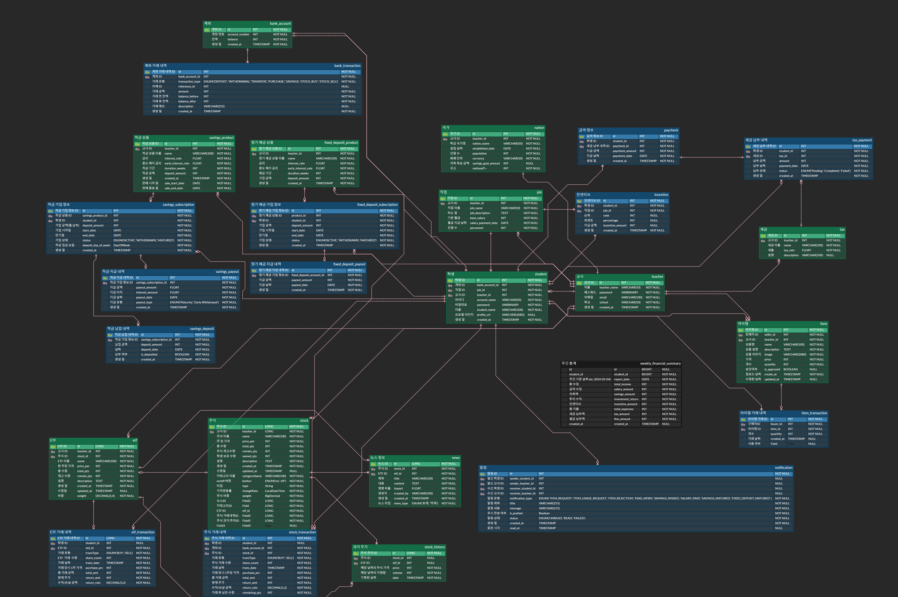
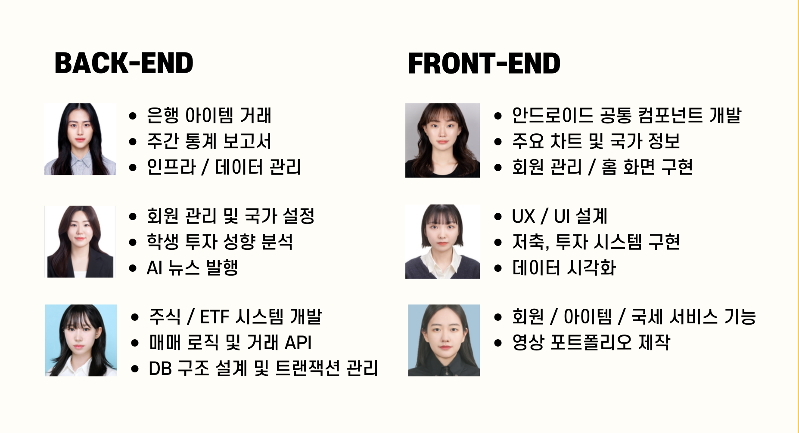

# 💰 땡그랑 (초등 경제 교육 서비스)

### 👆 위 이미지 클릭하면 `앱 소개 영상` 감상 가능합니다 👆

 

# 목차

1. [**개요**](#1)
1. [**주요 기능**](#2)
1. [**서비스 화면 (교사 / 학생)**](#3)
1. [**기술 스택**](#4)
1. [**프로젝트 진행 및 산출물**](#5)
1. [**개발 멤버 및 회고**](#6)
1. [**메뉴얼 및 상세문서**](#7)

 

# ✨ 개요

#### 서비스명 : 땡그랑 ( 똑똑한 경제 학습 )

#### 한줄 설명 : `디지털 교과서 전환에 맞춘, 테블릿 활용 초등 경제 학습 서비스`

#### 프로젝트 기간 : 2025.01.06 ~ 2025.02.21

 

# ✨ 주요 기능

-   서비스 설명 :
-   주요 기능 :
    -   기능1
    -   기능2
    -   기능3
    -   기능4

 

# 👩‍🏫 땡그랑 서비스 화면 (교사)

# 👧 땡그랑 서비스 화면 (학생)

 

# 📚 기술 스택

### Backend

 
  
  
  
  
  
  
  
  
  

### FrontEnd

 
  
  
  
  
  

### Infra

 
  
  
  
  
  

### Ai

 
  
  
  
  
  

## 기술적 특징

### K-Means 모델 활용

-   설명

### Open Ai 프롬프팅 전략

-   설명

## 서비스 아키텍처

 

# ✨ 프로젝트 진행 및 산출물

## 화면 설계서

-   피그마 정리해서 캡쳐

## API 명세서

-   노션 정리해서 캡쳐

## ERD

## Git

-   소스트리에서 브랜치 한눈에 보이게 캡쳐

 

# 👨‍👩‍👧‍👦 개발 멤버 및 역할분담

| **[정유진](https://github.com/breadbirds)** |               **[박진현]()**               |               **[서미지]()**               |               **[이사랑]()**               |               **[임정인]()**               |               **[최연지]()**               |
| :-----------------------------------------: | :----------------------------------------: | :----------------------------------------: | :----------------------------------------: | :----------------------------------------: | :----------------------------------------: |
|   |  |  |  |  |  |
|              Leader & Frontend              |                  Frontend                  |              Backend & Infra               |                  Frontend                  |                  Backend                   |                  Backend                   |

 

# 📒 메뉴얼 및 상세 문서

-   [포팅메뉴얼]()
-   [Git]()
-   [화면 설계서]()
-   [ERD]()
-   [API 명세서]()
