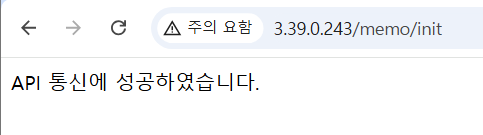
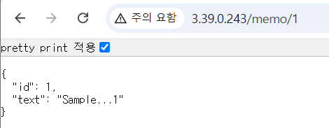
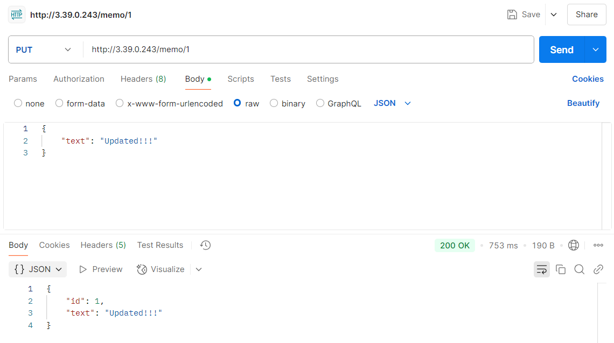
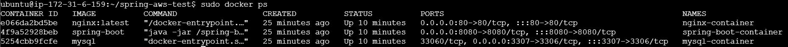

## TIL (Today I Learned)

### 📜 오늘 진행한 일

- (팀) 개인 TIL 작성
- (팀) Git 실습해보기(브랜치 생성, 커밋, 푸쉬)
- (팀) 기존 비슷한 서비스 사례 분석
  - 교실경제 콜럼버스(웹), 조세재정연구원 세심 교실(웹), 퍼플(모바일) 3가지 서비스를 직접 이용해보고 분석 진행
  - 전체적으로 UI/UX에 대한 아쉬움이 있었고 어떤 기능에 초점을 맞출 지에 대한 논의가 필요해보임
- (팀) 주요 기능 구상 및 정리
- AWS EC2 환경에서 Spring Boot 앱 배포 과정 중 발생한 MySQL 문제 해결
- Docker로 Nginx를 리버스 프록시로 설정하기

- 배포 화면

  
  
  
  

### ⛔ 문제가 있었던 것

- Docker 캐시로 인해 MySQL 같은 데이터베이스 볼륨이 유지되는 경우 MySQL 컨테이너를 삭제해도 docker volume이 남아 있어 데이터베이스 설정이 변경되지 않을 수 있음!
  -> Docker 볼륨을 삭제하고 다시 생성하는 것으로 해결...
- EC2 인스턴스가 빈번하게 멈추고 다시 접속이 안되는 문제...(한번 멈추면 10분 넘게 접속이 안돼서 실습에 지연이 됨) -> Swap 메모리 확보하는 방법이 있다고 한다!(진행 예정)

### 💡 새로 배운 것

- Docker는 이미지, 컨테이너, 네트워크, 볼륨을 캐시로 보관하기 때문에 이전 설정이나 코드가 반영되지 않아 오류가 계속 발생할 수 있다는 것을 배움...
  - 즉 `docker-compose up` 실행하면 기존 캐시가 유지된 상태에서 컨테이너가 실행된다는 것을 유념하자!
- Nginx 웹 서버가 리버스 프록시로서 하는 일에 대해서 공부함
  - nginx가 앞단에 있으면 스프링 서버를 직접 외부에 노출하지 않아도 되고 클라이언트 요청을 스프링 서버로 전달하는 중간 다리 역할을 할 수 있음
- ssh 클라이언트를 사용하여 EC2 인스턴스에 접속하는 설정을 적용하니 터미널에 단축키로 코드 붙여넣기가 가능하는 등 더 편리해짐

### ❓ 아직 잘 모르는 것, 부족한 것

- Docker 기초 지식이 부족해 트러블 슈팅에 오래 걸린 것 같아서 프로젝트 개발 전에 더 공부를 해야 할 것 같음
- 요구사항, 기능 등 명세서 작성이 막막함

### 💯 잘 한 것

- 오류를 해결하기 위해 인스턴스를 삭제하고 다시 생성하여 차근차근 단계적으로 진행하고 정리하면서 트러블 슈팅을 진행함
- 개인 TIL을 작성하며 이번 주에 진행한 일들을 회고해보면서 팀에 어떻게 기여할 수 있을지 고민하게 되면서 팀에서의 나의 역할에 대해서 생각해보는 계기가 되었음
