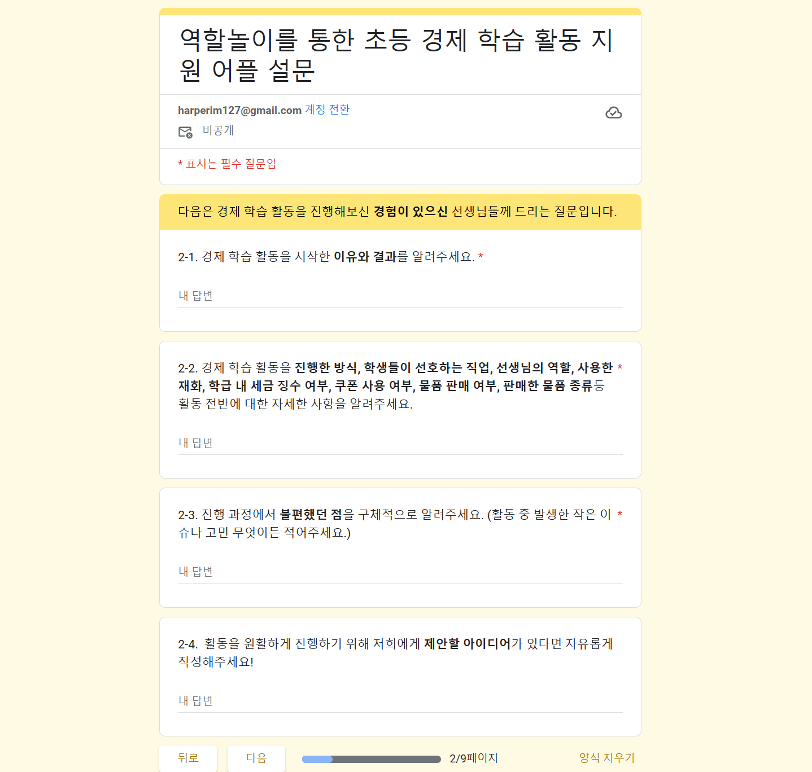

## TIL : 2025-01-14

### 오늘 한 일
1. 컨설턴트님과 상담
2. 상담내용 정리
3. 설문지 작성
    

### 문제가 있었던 것  
1. 설문 대상자에게 어떤 질문을 해야 우리가 원하는 답변을 얻을 수 있는지 고민해보았습니다. 

### 새로 배운 것  
1. 서비스 설계 단계 이전에 서비스의 유저를 대상으로 환경을 파악하기 위해 설문 조사 진행하는 단계가 있으면 더 구체적인 계획을 짜는데 많은 도움이 된다는 부분을 간과하고 있었습니다!

### 아직 잘 모르는 것, 부족한 것
1. 경제 관념을 아이들이 쉽게 이해할 수 있도록 쉽게 풀어내기!
2. 경제 관련 배경 지식에 대해 공부하기 
3. 실제 진행할 서비스의 유저들을 대상으로 환경에 대한 설문 조사 진행하기
4. 서비스의 디테일한 시스템(로직) 구성하기

### 잘한 것
1. 주제 선정 성공!