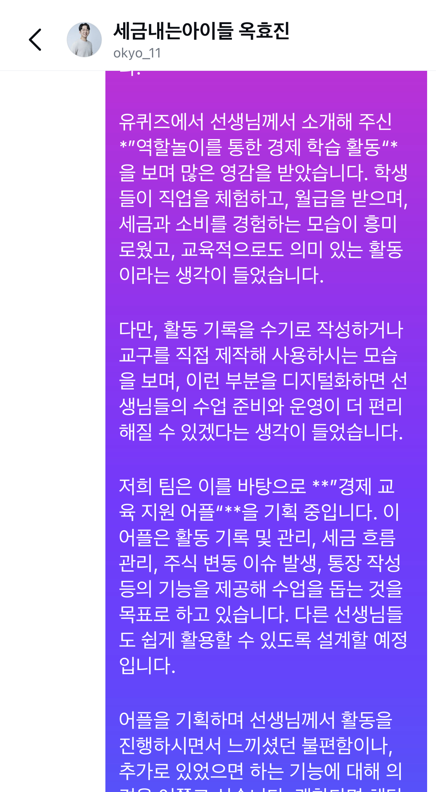
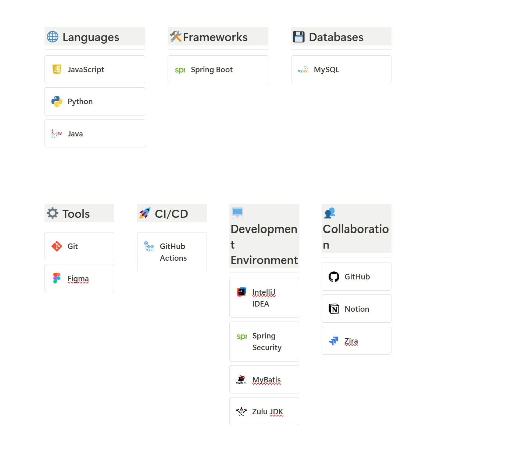
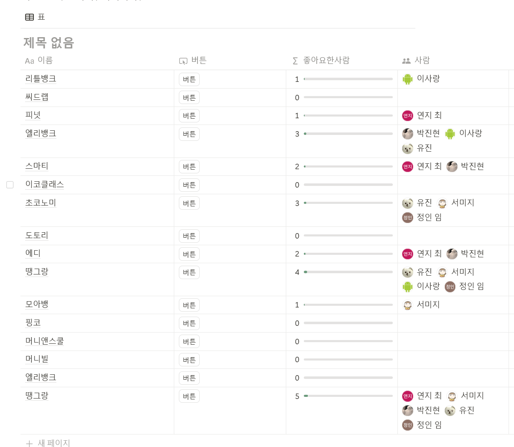

# 프로젝트 개발 일지

## 목차

-   [2025-01-15 작업 기록](#2025-01-15-작업-기록)

---

### 2025-01-15 
                                                                                    
| **작업 목표** | 
- 1. 설문 연락하기
- 2. 기술스택 정리, 회원가입 로그인 생성 하여 API 연결 연습습
- 3. 앱 이름 결정

## 작업 1: 설문 연락하기

| **작업 내용** | - 유퀴즈에서 나오신 초등학교 선생님 연락하기  

| **스크린샷**  |  

---

## 작업 2: 기술 스택 정리, 프로젝트 공부

| **작업 내용** | - 기술 스택 정리, 회원가입 로그인 생성 하여 API 연결 연습습

- 회원가입 로그인 생성 하여 API 연결

| **스크린샷**  |               

----
## 작업 3: 앱 이름 정하기기

| **작업 내용** | - 앱 이름 투표, 앱 이름: 땡그랑랑

| **스크린샷**  |  

