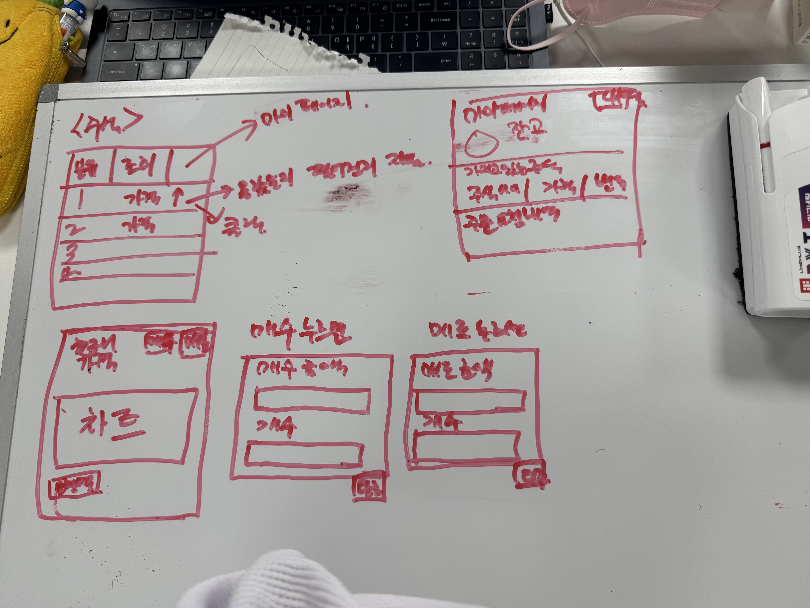
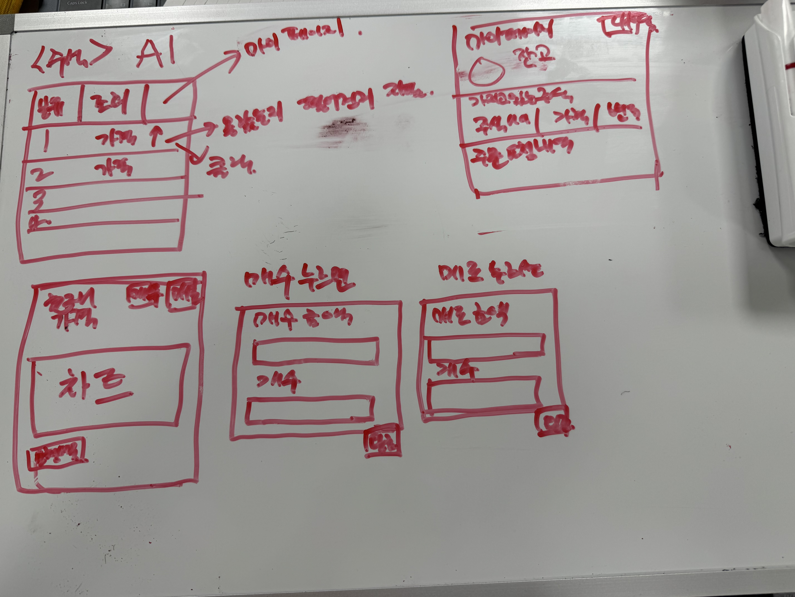
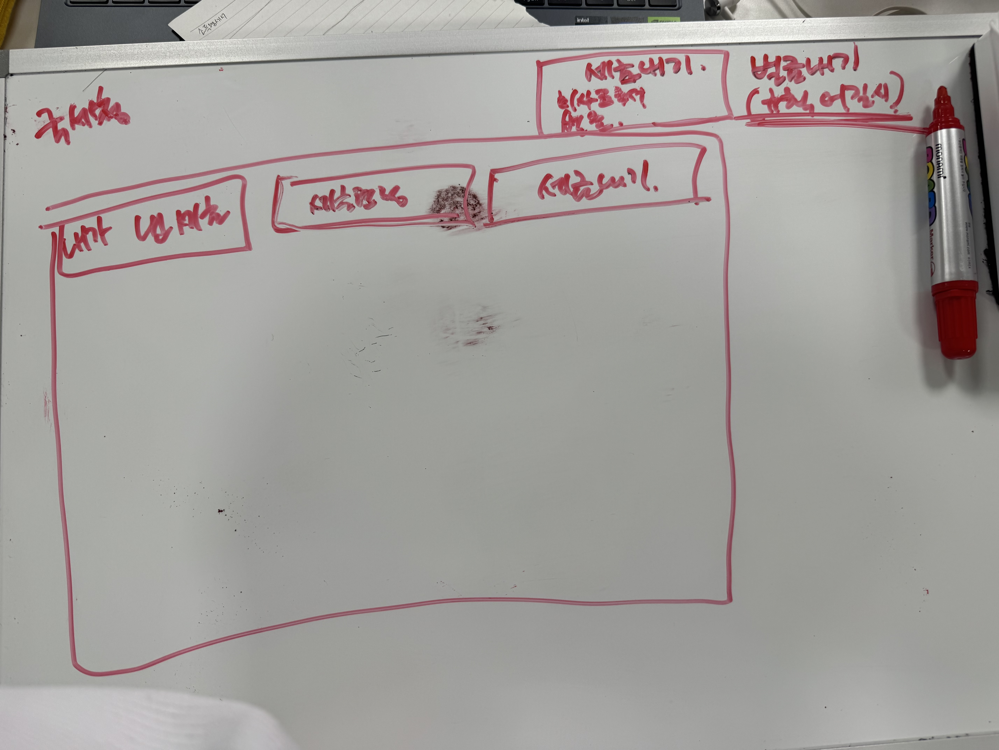
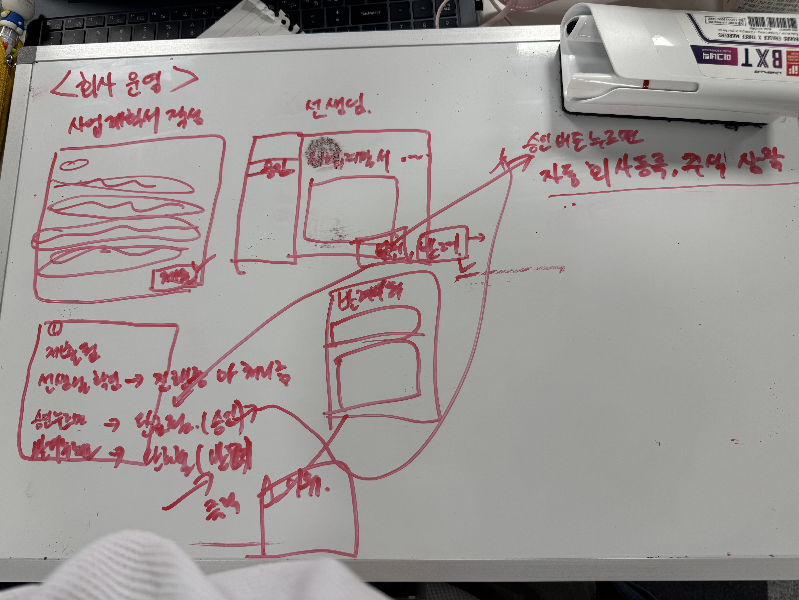
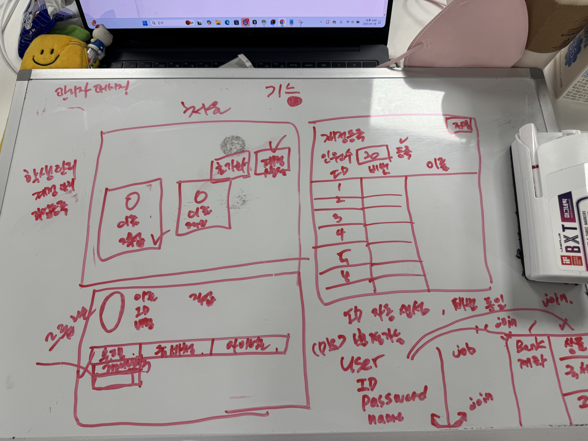

# 프로젝트 개발 일지

### 2025-01-15 
                                                                                    
| **작업 목표** | 
- 1. 기존 사이트 실습 해보기
- 2. 기능 구상

## 작업 1: 기존 사이트 실습습

| **작업 내용** | 
# 유사 서비스 분석

### 교실경제 컬럼버스 : Web

[교실경제 Columbus](https://www.economyclass.kr/)

[콜럼버스(교사용).pptx](%25EC%25BD%259C%25EB%259F%25BC%25EB%25B2%2584%25EC%258A%25A4(%25EA%25B5%2590%25EC%2582%25AC%25EC%259A%25A9).pptx)

`특징`

- 일반인도 회원 가입이 가능한 웹 기반 경제 교육 플랫폼

`단점`

- 웹 기반으로만 제공되어 모바일 접근성이 떨어질 수 있음
- 일반인 대상이라 초등학생에게 특화된 콘텐츠가 부족할 수 있음
- 사용자 맞춤형 학습 경로 제공이 제한적일 수 있음
- 실시간 상호작용이나 게임화된 요소가 부족할 수 있음

- 사용후기 → 
  
    - 최연지
        
        단점
        
        - DB 유지가 안됨
        - 초등학생이 쓰기엔 복잡하고 어려움
        - 컨텐츠 부족(미니 게임이라도 넣어줬으면)
        - 설명 부족
        - 모호한 기능
        - AI가 세금을 자동 계산하도록 구현하여 학생이 세금을 조작할 수 없도록 제한
            - 한 명만 된다고 적혀있는데 다 선택됨” → 선택 가능한 인원 제한 기능 수정 필요.
        
        **추가 기능**
        
        ### **회사 등록 & 사업 계획서 작성**
        
        1. **회사 등록**
            - 학생이 회사(가상 기업)를 등록할 수 있음.
            - 등록한 회사는 선생님이 승인하면 공개.
        2. **사업 계획서 작성**
            - 두 가지 입력 방식 지원:
                - **패드 필기**: 직접 글씨로 작성.
                - **타자 입력**: 키보드로 작성
            - 승인,반려 기능
                - 반려시 반려한 이유 작성 하도록!
            1. **주식 등록**
            - 선생님이 주식을 등록하고 **가격, 개수**를 지정.
            - 정기적으로 **주식장이 열리는 시간, 닫히는 시간** 선생님이 설정 가능
            - 회사 항목 클릭 하면 그래프 보임
                - 팔때(개수, 팔 금액)
                - 살때(개수, 살  금액)

### 조세재정연구원 세심 교실 : Web

[조세교육포털](https://www.kipf.re.kr/sesim/index.do)

교사 인증 받은 회원만 이용 가능

[함께하는 세심교실](https://sesimclass.kipf.re.kr/sesim)

이용 가능 사이트

`특징`

- 교사 인증을 받은 회원만 이용 가능한 웹 기반 조세 교육 포털

`단점`

- 접근성이 제한적이어서 학생들의 직접 사용이 어려움
- 조세에 초점을 맞춰 종합적인 경제 교육이 부족
- 교사 중심의 플랫폼으로 학생 참여형 콘텐츠가 부족
- 웹 기반으로만 제공되어 모바일 사용이 불편

- 사용 후기
           
    - 최연지
        
        장점
        
        UI가 커서 보기 쉬움
        
        상세한 구현
        
        단점
        
        재미 요소가 없음
        
        **추가기능** 
        
        - **타이핑 게임**: 제한 시간 내에 단어를 빠르게 입력.
        - **클릭 게임**: 화면에 나타나는 목표를 빠르게 클릭.
        - **퀴즈 게임**: 질문과 정답 선택.
        - **퍼즐 게임**: 블록 맞추기, 카드 매칭.
        - **간단한 아케이드 게임**: 예를 들어 공 피하기, 점프 게임
        
        **주식**

### 퍼플 경제교실 : Mobile

[퍼플 - 경제 교실 - Apps on Google Play](https://play.google.com/store/apps/details?id=com.bluegreen.mce)

앱 마지막 업데이트 : 2023. 9. 22.
앱 내부 공지 : 2024.7.6
- 전반적인 평가가 나쁘지 않지만 디자인, 디테일 적인 기능 부분에서 개선 요청사항이 있음
- 사람이 몰리는 특정 시간대에 트래픽 초과로 이용 불가

`특징`

- 모바일 기반의 경제 교육 앱

`단점`

- 앱의 기능이나 콘텐츠의 다양성이 제한적
- 교사나 부모의 관리 기능이 부족
- 아이들이 사용하기에 직관적이지 않는 UI/UX  구조
- 컨텐츠 이용에 대한 설명 부족

[함께하는 세심교실](https://sesimclass.kipf.re.kr/)

---

## 작업 2: 기능 구상

| **작업 내용** | - 기능 구상 하기기

| **스크린샷**  |      
         
         
         
                 

----
